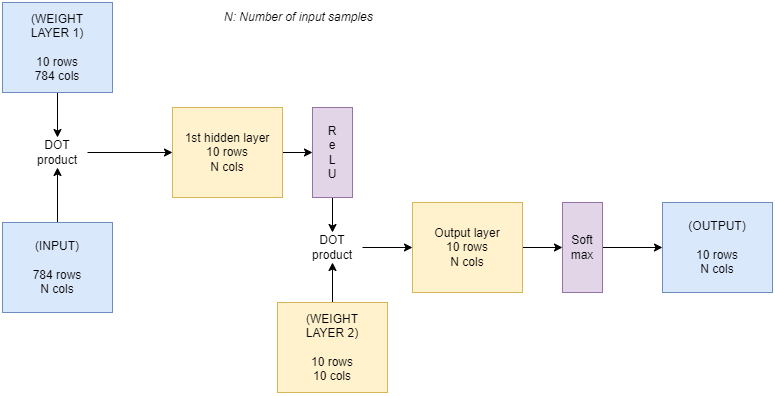

# MNIST digit recognizer built from scratch
Here I tried to build MNIST digit recognizer with a simple 2-layer neural network written completely using Numpy and Pandas without any Pytorch or Tensorflow libraries.

The Input layer of the Neural network took a 28x28 (784) pixel image. In the first hidden layer, we have 10 neurons, the output of which gets clipped using ReLU (Rectified Linear Unit), the output of first hidden layer goes to the output layer, which has also got 10 neurons for 10 classes to be classfied, and a Softmax operation to generate the probabilities of the classified class.

**This simple Neural Network comes out at 84% accuracy**

# Experiments
1. Tried the normal gradient descent over the complete training data set, for 8 epochs

This design comes as only 11% accurate after running 8 Epochs.

2.  Tried the same example with Stochastic gradient descent, which is to divide the training data set over 60 batches and then run 8 epochs to train the network.

The result is much better, in almost identical time, the design gets 84% accuracy.
